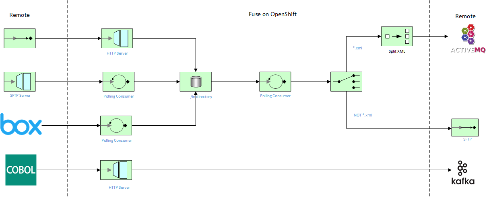

<h1 align="center">Managed File Transfer with Cache<br/>using Fuse on Openshift</h1>

This project demonstrates a few simple MFT flows using Fuse on Openshift, including connectivity to a data cache:



This flow includes the following services

1. [Flow One: HTTP Upload Endpoint](./http-upload-service)
2. [Flow Two: SFTP Download Endpoint](./sftp-download)
3. [Flow Three: File Split AMQ Producer](./wmq-upload-service)
4. [Flow Four: SFTP Push](./sftp-upload)

Prerequisites
==============================

- Openshift 4.2+, Integreatly on RHPDS, or RHMI instance
- Fuse 7.5+ Image Streams (template found [here](https://raw.githubusercontent.com/jboss-fuse/application-templates/master/fis-image-streams.json))
- Fuse Online 7.5+

Installation instructions for Integreatly
==============================

1. Provision an Openshift 4.2+ cluster
2. Execute the following via the CLI: `git clone -b keycloak-cert-fix https://github.com/akoserwal/integreatly-operator`.  This branch has a fix required for the Keycloak (rhsso) Operator.
3. Via the CLI, execute the following prerequisite commands:

```
make code/compile
go install github.com/matryer/moq
```

4. Whilst logged into the cluster as cluster-admin, execute the following via the CLI:

```
make cluster/prepare/project
make cluster/prepare/crd
make cluster/prepare/smtp
```

5. Via the web console, navigate to the the `redhat-rhmi-operator` project and open **Operators > OperatorHub**.  Search for RHMI and click *Install*.

6. Give the cluster 15-20 minutes to install and startup.  To check the installation, execute the following command via the CLI:

```
oc get rhmi -n redhat-rhmi-operator -o yaml
```

Verify the status of each component.  You can also check if any pods are stuck by navigating to **Home > Dashboards** and checking the *Cluster Inventory*.  From you there you can manually delete and restart pods as required.

7. Once all the components are installed (redhat-rhmi-solution-explorer is the final component), execute the following via the CLI:

```
export PASSWORD=openshift
./scripts/setup-sso-idp.sh
```

This command will create all the necessary users for your Integreatly cluster.  Copy and past the output for safekeeping.

8. Via the webconsole, update the Secrets that contain "S3" with the credentials for your S3 buckets.  You will need AWS access ID, secret key, bucket name and region ID.