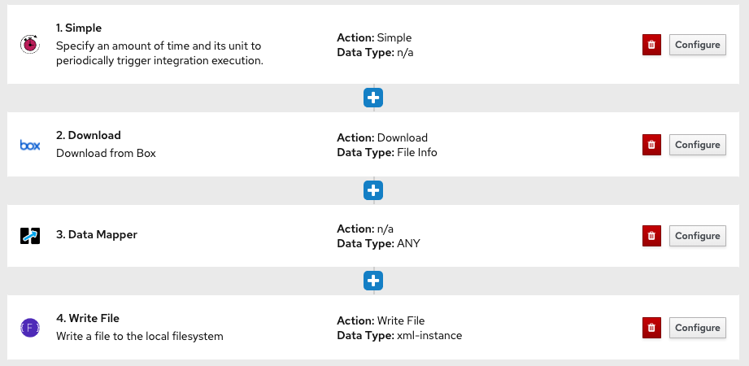
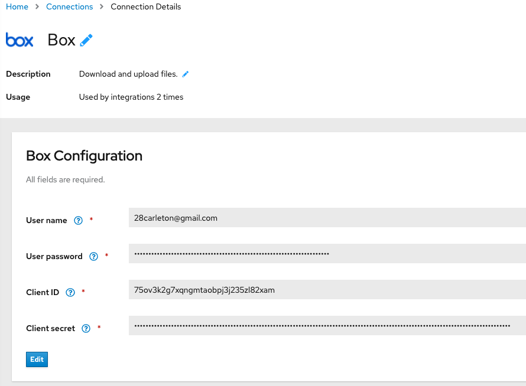
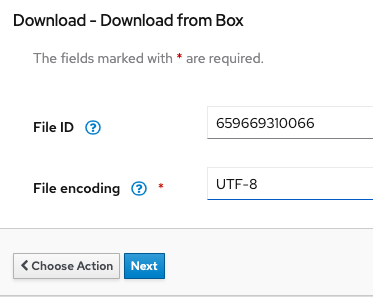

Box Download
=============

This flow polls a remote Box directory and downloads files to the centralized `/mnt/mft/in` directory.

  

### Configuration

1. In Fuse Online, create a new Connection to your Box account.  It should look similar to below, and be sure to validate the connection. You will need to copy the OAuth2 callback URL from Fuse Online's **Settings** menu and copy it into your Box Developer Application Oauth2.0 configuration page.

  

2. If you haven't already done so, build the `syndesis-connector-file2` step extension, and import it into Fuse Online.

3.  If you haven't already done so, create a Connector called `File Connector` using the imported step extension.

4. Create a new Integration and add the following steps, as depicted in the image above.  For the remote Box server download configuration, be sure to use the following configuration

  

5. For the *Write File* step, set the *Directory Name* `/mnt/mft/in?fileName=cobol.account-${date:now:yyyyMMddHHmmssSSS}.ready&tempFileName=.inprogress`.

6. Publish the flow and navigate to the `Syndesis` project in the OCP Web UI.

7. Once the Box Download integration is deployed, update the deployment config to attach the `nfs-pvc-01` storage.  Re-deploy the integration.

### Testing the flow

1.  Drop a *cobol.account* file in the Box `/download` directory.
2. Once the file is consumed and deleted, navigate to the running Pod terminal (via OCP UI) and navigate to `/mnt/mft/` directory.  
3. Check the sub-directories to ensure the file has be routed correctly.