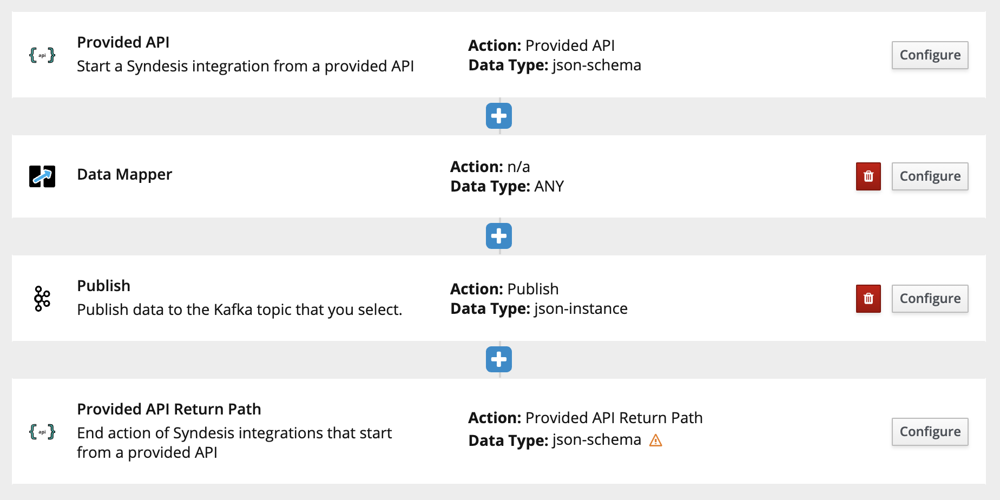
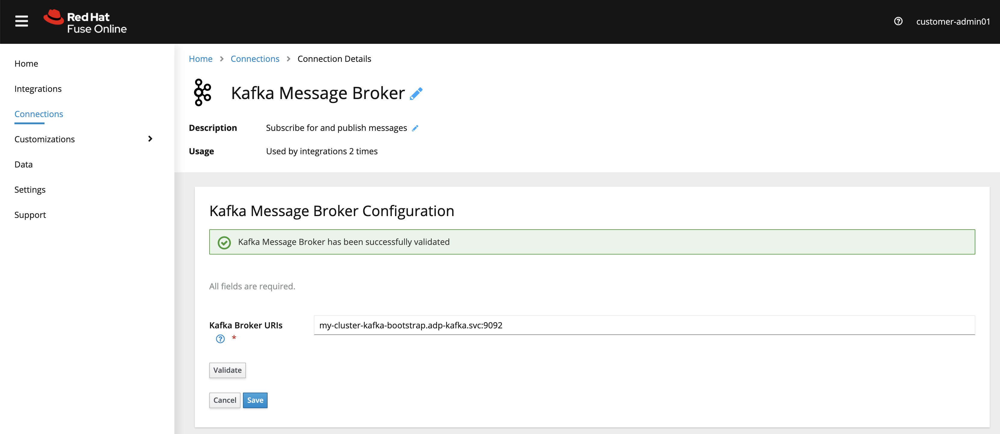
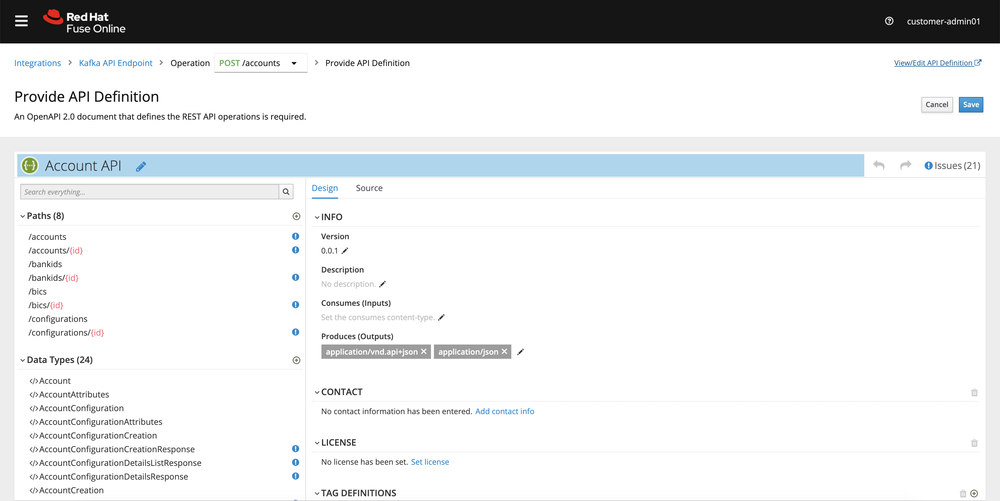
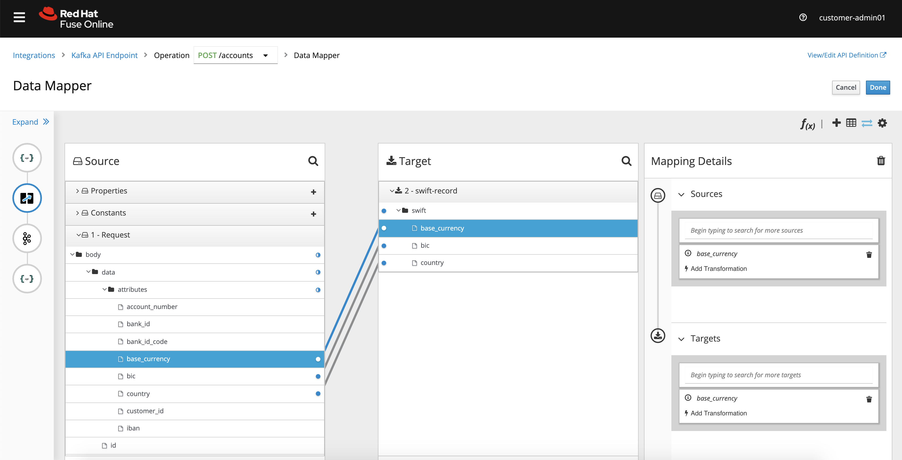

Kafka API
=============

This flow stands-up an Account API endpoint and forwards a transformed request to Kafka.  The API returns the transformed payload (in JSON) to the requestor.

<p align="center">
  
</p>

Setup
==============================

- Install AMQ Streams cluster (using default config items e.g. my-cluster, my-topic etc.

### Configuration

1. In Fuse Online, create a new Connection to your Kafka cluster.  It should look similar to below, and be sure to validate the connection.

<p align="center">
  
</p>

2. Create a new Integration and add the following steps, as depicted in the image below.  You can setup an API Endpoint using the attached OpenAPI specification found in `/schema/account-api.yaml`.  Be sure to give the `/accounts` POST operation an **operationID**.

<p align="center">
  
</p>

3. Creat a flow for the `/accounts` POST operation.  Add a Kafka step subscribing to **my-topic**. Give it the following JSON instance data shape:

```
 {
 	"swift": {
 		"country": "US",
 		"base_currency": "AUD",
 		"bic": "NATAAU33"
 	}
 }
```

4. Create data mapping steps before and after the Kafka subscribe step.  Map the country / base_currency / bic fields accordingly.

<p align="center">
  
</p>

5. Save & Publish the flow with the following name: `Kafka API Endpoint`.

### Testing the flow

1.  You can test the flow using the following cURL command:

```
curl -s -X POST \
  https://i-kafka-api-endpoint-redhat-rhmi-fuse.apps.cluster-abcdef-a0d5.abcdef-a0d5.example.opentlc.com/v1/accounts \
  -H 'cache-control: no-cache' \
  -H 'content-type: application/json' \
  -d  \
  '{"data": {"type": "B","id": "BTMN167384","version": 1,"organisation_id": "SGBLAU2S_20032019","attributes": {"country": "US","base_currency": "AUD","bic": "NATAAU33"}}}'
```