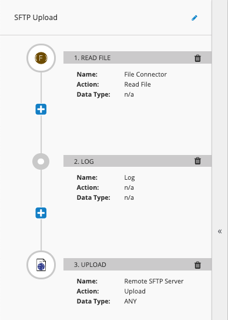
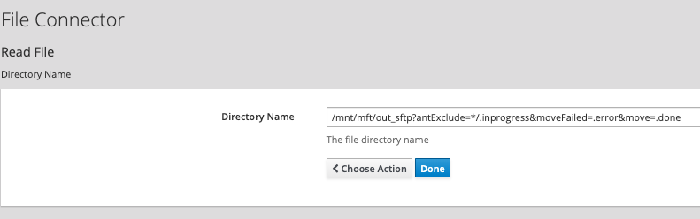
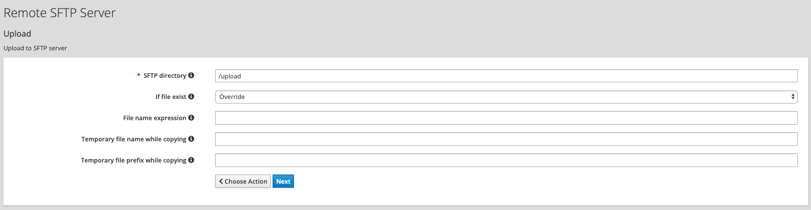

SFTP Upload
=============

This flow consumes files from `/mnt/mft/out_sftp` directory, then pushes the files to a remote SFTP directory.

  

### Configuration

1. If you haven't already done so, build the `syndesis-connector-file2` step extension, and import it into Fuse Online.

2. If you haven't already done so, create a Connector called `File Connector` using the imported step extension.

3. Create a new Integration and add the following steps, as depicted in the image above.  For the *Read File* configuration, be sure to use the following configuration.  You can use the following text for *Directory Name*: `/mnt/mft/out_sftp?antExclude=*/.inprogress&moveFailed=.error&move=.done`.

  

4. For the *SFTP Upload* step, configure it as below:

  

5. Publish the flow and navigate to the `Shared Fuse` project in the OCP Web UI.

6. Once the SFTP integration is deployed, update the deployment config to attach the `nfs-pvc-01` storage.  Re-deploy the integration.

### Testing the flow

1.  Drop a non-XML file in the `/download` directory.
2. Once the file is consumed and deleted, navigate to the running Pod terminal (via OCP UI) and navigate to `/mnt/mft/` directory.  
3. Check the sub-directories to ensure the file has be routed correctly.